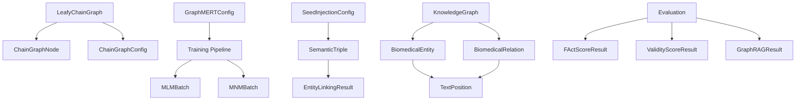
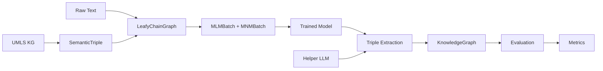

# GraphMERT Data Model

## Overview

This document defines all data structures and their relationships for the GraphMERT implementation. These types are derived from the feature requirements (spec.md) and the comprehensive technical specification (Doc 11: Data Structures).

**Status**: Complete design ready for implementation
**Last Updated**: 2025-01-20

---

## Core Graph Structures

### 1. Chain Graph Node

Represents a single node in the leafy chain graph (either root or leaf).

```julia
"""
    ChainGraphNode

Represents a node in the leafy chain graph structure.

# Fields
- `node_type::Symbol`: Either `:root` (syntactic) or `:leaf` (semantic)
- `token_id::Int`: Token ID from vocabulary (0 to vocab_size-1)
- `position::Int`: Position in the graph structure
- `parent_root::Union{Int, Nothing}`: For leaves: which root they belong to
- `is_padding::Bool`: Whether this is a padding node
"""
struct ChainGraphNode
    node_type::Symbol  # :root or :leaf
    token_id::Int
    position::Int
    parent_root::Union{Int, Nothing}
    is_padding::Bool
end
```

**Validation Rules**:
- `node_type ∈ {:root, :leaf}`
- `token_id ≥ 0`
- `parent_root` must be valid root index for `:leaf` nodes
- `parent_root` must be `nothing` for `:root` nodes

---

### 2. Leafy Chain Graph Configuration

```julia
"""
    ChainGraphConfig

Configuration parameters for leafy chain graph construction.

# Fields
- `num_roots::Int`: Number of root nodes (default: 128)
- `num_leaves_per_root::Int`: Number of leaves per root (default: 7)
- `vocab_size::Int`: Size of token vocabulary
- `pad_token_id::Int`: Token ID for padding (default: 1)
- `mask_token_id::Int`: Token ID for masking (default: 103)
- `precompute_shortest_paths::Bool`: Whether to precompute Floyd-Warshall (default: true)
"""
struct ChainGraphConfig
    num_roots::Int
    num_leaves_per_root::Int
    vocab_size::Int
    pad_token_id::Int
    mask_token_id::Int
    precompute_shortest_paths::Bool
end
```

**Default Values**:
```julia
function default_chain_graph_config(vocab_size::Int=30522)
    ChainGraphConfig(
        128,        # num_roots
        7,          # num_leaves_per_root
        vocab_size,
        1,          # pad_token_id
        103,        # mask_token_id
        true        # precompute_shortest_paths
    )
end
```

---

### 3. Leafy Chain Graph

The main graph structure combining syntactic and semantic spaces.

```julia
"""
    LeafyChainGraph

Complete leafy chain graph structure combining roots (syntactic) and leaves (semantic).

# Fields
- `root_nodes::Vector{ChainGraphNode}`: All root nodes (length: num_roots)
- `leaf_nodes::Vector{Vector{ChainGraphNode}}`: Leaves organized by parent root
- `adjacency_matrix::Matrix{Bool}`: Graph connectivity (N×N where N=total nodes)
- `shortest_paths::Union{Matrix{Int}, Nothing}`: Precomputed shortest paths
- `config::ChainGraphConfig`: Graph configuration
- `metadata::Dict{String, Any}`: Additional metadata

# Derived Properties
- Total nodes: num_roots + (num_roots × num_leaves_per_root)
- Sequence length: Total nodes (typically 1024)
"""
struct LeafyChainGraph
    root_nodes::Vector{ChainGraphNode}
    leaf_nodes::Vector{Vector{ChainGraphNode}}
    adjacency_matrix::Matrix{Bool}
    shortest_paths::Union{Matrix{Int}, Nothing}
    config::ChainGraphConfig
    metadata::Dict{String, Any}
end
```

**Invariants**:
- `length(root_nodes) == config.num_roots`
- `length(leaf_nodes) == config.num_roots`
- `all(length(leaves) == config.num_leaves_per_root for leaves in leaf_nodes)`
- `size(adjacency_matrix) == (total_nodes, total_nodes)` where `total_nodes = num_roots × (1 + num_leaves_per_root)`
- Graph connectivity: roots connected to their leaves, leaves connected to each other within same root

---

## Training Data Structures

### 4. MLM Configuration

```julia
"""
    MLMConfig

Configuration for Masked Language Modeling training objective.

# Fields
- `vocab_size::Int`: Vocabulary size
- `hidden_size::Int`: Model hidden dimension
- `max_span_length::Int`: Maximum span length for masking (default: 7)
- `mask_probability::Float64`: Probability of masking tokens (default: 0.15)
- `mask_token_ratio::Float64`: Ratio of tokens replaced with [MASK] (default: 0.8)
- `random_token_ratio::Float64`: Ratio of tokens replaced with random (default: 0.1)
- `unchanged_ratio::Float64`: Ratio of tokens left unchanged (default: 0.1)
- `boundary_loss_weight::Float64`: Weight for boundary loss (default: 1.0)
- `geometric_p::Float64`: Geometric distribution param for span sampling (default: 0.2)
"""
struct MLMConfig
    vocab_size::Int
    hidden_size::Int
    max_span_length::Int
    mask_probability::Float64
    mask_token_ratio::Float64
    random_token_ratio::Float64
    unchanged_ratio::Float64
    boundary_loss_weight::Float64
    geometric_p::Float64
end
```

**Validation**:
- `mask_token_ratio + random_token_ratio + unchanged_ratio ≈ 1.0`
- `0 < mask_probability < 1`

---

### 5. MNM Configuration

```julia
"""
    MNMConfig

Configuration for Masked Node Modeling training objective.

# Fields
- `vocab_size::Int`: Vocabulary size
- `hidden_size::Int`: Model hidden dimension
- `num_leaves::Int`: Number of leaves per root (must match graph config)
- `mask_probability::Float64`: Probability of masking leaf groups (default: 0.15)
- `relation_dropout::Float64`: Dropout on relation embeddings (default: 0.3)
- `loss_weight::Float64`: Weight in joint loss (μ parameter, default: 1.0)
- `mask_entire_leaf_span::Bool`: Whether to mask all leaves of a root together (default: true)
"""
struct MNMConfig
    vocab_size::Int
    hidden_size::Int
    num_leaves::Int
    mask_probability::Float64
    relation_dropout::Float64
    loss_weight::Float64
    mask_entire_leaf_span::Bool
end
```

---

### 6. Training Batch Structures

```julia
"""
    MLMBatch

Batch data for MLM training.

# Fields
- `input_ids::Matrix{Int}`: Token IDs (batch_size × seq_len)
- `attention_mask::Matrix{Bool}`: Attention mask (batch_size × seq_len)
- `masked_positions::Vector{Vector{Int}}`: Positions of masked tokens per example
- `original_tokens::Vector{Vector{Int}}`: Original token IDs before masking
- `boundary_targets::Union{Vector{Vector{Int}}, Nothing}`: Boundary prediction targets
"""
struct MLMBatch
    input_ids::Matrix{Int}
    attention_mask::Matrix{Bool}
    masked_positions::Vector{Vector{Int}}
    original_tokens::Vector{Vector{Int}}
    boundary_targets::Union{Vector{Vector{Int}}, Nothing}
end
```

```julia
"""
    MNMBatch

Batch data for MNM training.

# Fields
- `graph_sequence::Matrix{Int}`: Graph as sequence (batch_size × seq_len)
- `attention_mask::Matrix{Bool}`: Attention mask with graph structure
- `masked_leaf_spans::Vector{Vector{Tuple{Int,Int}}}`: (start, end) of masked leaves
- `original_leaf_tokens::Vector{Vector{Int}}`: Original leaf tokens before masking
- `relation_ids::Matrix{Int}`: Relation IDs for H-GAT (batch_size × num_leaves)
"""
struct MNMBatch
    graph_sequence::Matrix{Int}
    attention_mask::Matrix{Bool}
    masked_leaf_spans::Vector{Vector{Tuple{Int,Int}}}
    original_leaf_tokens::Vector{Vector{Int}}
    relation_ids::Matrix{Int}
end
```

---

## Seed KG Injection Structures

### 7. Semantic Triple

```julia
"""
    SemanticTriple

Represents a knowledge graph triple for seed injection.

# Fields
- `head::String`: Head entity text
- `head_cui::Union{String, Nothing}`: UMLS CUI for head
- `relation::String`: Relation type
- `tail::String`: Tail entity text
- `tail_tokens::Vector{Int}`: Tokenized tail (for leaf injection)
- `score::Float64`: Similarity/confidence score
- `source::String`: Source KG (e.g., "UMLS", "SNOMED_CT")
"""
struct SemanticTriple
    head::String
    head_cui::Union{String, Nothing}
    relation::String
    tail::String
    tail_tokens::Vector{Int}
    score::Float64
    source::String
end
```

---

### 8. Seed Injection Configuration

```julia
"""
    SeedInjectionConfig

Configuration for seed KG injection algorithm.

# Fields
- `entity_linking_threshold::Float64`: Jaccard similarity threshold (default: 0.5)
- `top_k_candidates::Int`: Number of candidates from SapBERT (default: 10)
- `top_n_triples_per_entity::Int`: Number of triples per entity (default: 40)
- `alpha_score_threshold::Float64`: Minimum similarity score (default: 0.7)
- `score_bucket_size::Int`: Number of buckets by score (default: 10)
- `relation_bucket_size::Int`: Number of buckets by relation frequency (default: 5)
- `injection_ratio::Float64`: Percentage of sequences to inject (default: 0.2)
- `max_triples_per_sequence::Int`: Maximum triples injected per sequence (default: 10)
"""
struct SeedInjectionConfig
    entity_linking_threshold::Float64
    top_k_candidates::Int
    top_n_triples_per_entity::Int
    alpha_score_threshold::Float64
    score_bucket_size::Int
    relation_bucket_size::Int
    injection_ratio::Float64
    max_triples_per_sequence::Int
end
```

---

### 9. Entity Linking Result

```julia
"""
    EntityLinkingResult

Result of entity linking to UMLS.

# Fields
- `entity_text::String`: Original entity mention
- `cui::String`: UMLS CUI (Concept Unique Identifier)
- `preferred_name::String`: UMLS preferred name
- `semantic_types::Vector{String}`: UMLS semantic types
- `similarity_score::Float64`: Linking confidence
- `source::String`: Method used ("sapbert", "exact_match", "fuzzy")
"""
struct EntityLinkingResult
    entity_text::String
    cui::String
    preferred_name::String
    semantic_types::Vector{String}
    similarity_score::Float64
    source::String
end
```

---

## Biomedical Domain Structures

### 10. Biomedical Entity

```julia
"""
    BiomedicalEntity

Extracted biomedical entity with metadata.

# Fields
- `text::String`: Entity text as appears in source
- `normalized_text::String`: Normalized form
- `entity_type::String`: Entity type (e.g., "Disease", "Drug", "Gene")
- `cui::Union{String, Nothing}`: UMLS CUI if linked
- `semantic_types::Vector{String}`: UMLS semantic types
- `position::TextPosition`: Location in source text
- `confidence::Float64`: Extraction confidence (0-1)
- `provenance::String`: Source sentence/paragraph
"""
struct BiomedicalEntity
    text::String
    normalized_text::String
    entity_type::String
    cui::Union{String, Nothing}
    semantic_types::Vector{String}
    position::TextPosition
    confidence::Float64
    provenance::String
end
```

---

### 11. Biomedical Relation

```julia
"""
    BiomedicalRelation

Extracted biomedical relation between entities.

# Fields
- `head_entity_id::Int`: Index into entities vector
- `tail_entity_id::Int`: Index into entities vector
- `relation_type::String`: Relation type (e.g., "treats", "causes")
- `relation_id::Union{String, Nothing}`: UMLS relation ID if applicable
- `confidence::Float64`: Extraction confidence (0-1)
- `evidence::String`: Supporting text span
- `provenance::String`: Source sentence
"""
struct BiomedicalRelation
    head_entity_id::Int
    tail_entity_id::Int
    relation_type::String
    relation_id::Union{String, Nothing}
    confidence::Float64
    evidence::String
    provenance::String
end
```

---

### 12. Text Position

```julia
"""
    TextPosition

Represents position of text span in source document.

# Fields
- `start_char::Int`: Starting character index (0-indexed)
- `end_char::Int`: Ending character index (exclusive)
- `start_token::Int`: Starting token index
- `end_token::Int`: Ending token index (exclusive)
"""
struct TextPosition
    start_char::Int
    end_char::Int
    start_token::Int
    end_token::Int
end
```

---

## Output Structures

### 13. Knowledge Graph

```julia
"""
    KnowledgeGraph

Complete extracted knowledge graph with entities and relations.

# Fields
- `entities::Vector{BiomedicalEntity}`: All extracted entities
- `relations::Vector{BiomedicalRelation}`: All extracted relations
- `triples::Vector{Tuple{Int,Int,Int}}`: (head_idx, relation_idx, tail_idx)
- `source_text::String`: Original text source
- `metadata::Dict{String,Any}`: Additional metadata
  - "extraction_time": timestamp
  - "model_version": GraphMERT version
  - "config": extraction configuration
  - "statistics": counts, scores, etc.
"""
struct KnowledgeGraph
    entities::Vector{BiomedicalEntity}
    relations::Vector{BiomedicalRelation}
    triples::Vector{Tuple{Int,Int,Int}}
    source_text::String
    metadata::Dict{String,Any}
end
```

**Invariants**:
- All `head_entity_id` and `tail_entity_id` in relations must be valid indices into `entities`
- All indices in `triples` must be valid
- `length(triples) == length(relations)` (one-to-one correspondence)

---

## Model Configuration Structures

### 14. GraphMERT Configuration

```julia
"""
    GraphMERTConfig

Complete configuration for GraphMERT model.

# Fields
- `vocab_size::Int`: Vocabulary size (default: 30522 for BioMedBERT)
- `hidden_size::Int`: Hidden dimension (default: 512)
- `num_hidden_layers::Int`: Number of transformer layers (default: 12)
- `num_attention_heads::Int`: Number of attention heads (default: 8)
- `intermediate_size::Int`: Feed-forward intermediate size (default: 2048)
- `hidden_dropout_prob::Float64`: Dropout probability (default: 0.1)
- `attention_probs_dropout_prob::Float64`: Attention dropout (default: 0.1)
- `max_position_embeddings::Int`: Maximum sequence length (default: 1024)
- `type_vocab_size::Int`: Number of token types (default: 2)
- `layer_norm_eps::Float64`: Layer norm epsilon (default: 1e-12)
- `num_relation_types::Int`: Number of relation types for H-GAT (default: 50)
- `relation_embedding_dim::Int`: Relation embedding size (default: 64)
- `hgat_num_heads::Int`: H-GAT attention heads (default: 4)
- `decay_lambda::Float64`: Attention decay parameter (default: 0.6)
- `decay_p_init::Float64`: Initial decay threshold (default: 1.0)
"""
struct GraphMERTConfig
    vocab_size::Int
    hidden_size::Int
    num_hidden_layers::Int
    num_attention_heads::Int
    intermediate_size::Int
    hidden_dropout_prob::Float64
    attention_probs_dropout_prob::Float64
    max_position_embeddings::Int
    type_vocab_size::Int
    layer_norm_eps::Float64
    num_relation_types::Int
    relation_embedding_dim::Int
    hgat_num_heads::Int
    decay_lambda::Float64
    decay_p_init::Float64
end
```

---

### 15. Processing Options

```julia
"""
    ProcessingOptions

Runtime options for GraphMERT processing.

# Fields
- `batch_size::Int`: Batch size for processing (default: 32)
- `max_length::Int`: Maximum sequence length (default: 1024)
- `device::Symbol`: Compute device (`:cpu`, `:cuda`) (default: :cpu)
- `use_amp::Bool`: Use automatic mixed precision (default: false)
- `num_workers::Int`: Number of parallel workers (default: 1)
- `seed::Union{Int, Nothing}`: Random seed for reproducibility
- `top_k_predictions::Int`: Top-k for tail prediction (default: 20)
- `similarity_threshold::Float64`: Filtering threshold (β, default: 0.8)
- `enable_provenance_tracking::Bool`: Track provenance (default: true)
"""
struct ProcessingOptions
    batch_size::Int
    max_length::Int
    device::Symbol
    use_amp::Bool
    num_workers::Int
    seed::Union{Int, Nothing}
    top_k_predictions::Int
    similarity_threshold::Float64
    enable_provenance_tracking::Bool
end
```

---

## Evaluation Structures

### 16. FActScore Result

```julia
"""
    FActScoreResult

Result of FActScore* evaluation (factuality + validity).

# Fields
- `triple_scores::Vector{Bool}`: Per-triple factuality scores
- `triple_contexts::Vector{String}`: Context for each triple
- `overall_score::Float64`: Aggregate FActScore (0-1)
- `num_supported::Int`: Number of supported triples
- `num_total::Int`: Total number of triples
- `metadata::Dict{String,Any}`: Additional evaluation details
"""
struct FActScoreResult
    triple_scores::Vector{Bool}
    triple_contexts::Vector{String}
    overall_score::Float64
    num_supported::Int
    num_total::Int
    metadata::Dict{String,Any}
end
```

---

### 17. ValidityScore Result

```julia
"""
    ValidityScoreResult

Result of ValidityScore evaluation (ontological validity).

# Fields
- `triple_validity::Vector{Symbol}`: Per-triple validity (:yes, :maybe, :no)
- `overall_score::Float64`: Percentage of valid triples (0-1)
- `num_yes::Int`: Number of definitely valid triples
- `num_maybe::Int`: Number of possibly valid triples
- `num_no::Int`: Number of invalid triples
- `justifications::Vector{String}`: LLM justifications for each decision
"""
struct ValidityScoreResult
    triple_validity::Vector{Symbol}
    overall_score::Float64
    num_yes::Int
    num_maybe::Int
    num_no::Int
    justifications::Vector{String}
end
```

---

### 18. GraphRAG Result

```julia
"""
    GraphRAGResult

Result of GraphRAG evaluation (graph-level utility).

# Fields
- `questions::Vector{String}`: Evaluation questions
- `predicted_answers::Vector{String}`: Model-generated answers
- `ground_truth::Vector{String}`: Gold standard answers
- `correct_flags::Vector{Bool}`: Whether each answer is correct
- `accuracy::Float64`: Overall accuracy (0-1)
- `local_search_stats::Dict{String,Any}`: Statistics about local search
"""
struct GraphRAGResult
    questions::Vector{String}
    predicted_answers::Vector{String}
    ground_truth::Vector{String}
    correct_flags::Vector{Bool}
    accuracy::Float64
    local_search_stats::Dict{String,Any}
end
```

---

## Helper LLM Integration Structures

### 19. LLM Request/Response

```julia
"""
    LLMRequest

Request to helper LLM.

# Fields
- `prompt::String`: Prompt template
- `context::String`: Context for prompt
- `task_type::Symbol`: Task type (:entity_discovery, :relation_matching, :tail_formation)
- `temperature::Float64`: Sampling temperature (default: 0.0 for deterministic)
- `max_tokens::Int`: Maximum response tokens (default: 500)
"""
struct LLMRequest
    prompt::String
    context::String
    task_type::Symbol
    temperature::Float64
    max_tokens::Int
end
```

```julia
"""
    LLMResponse

Response from helper LLM.

# Fields
- `raw_response::String`: Raw LLM output
- `parsed_result::Any`: Parsed result (task-specific)
- `success::Bool`: Whether parsing succeeded
- `error_message::Union{String, Nothing}`: Error message if failed
- `metadata::Dict{String,Any}`: Token counts, latency, etc.
"""
struct LLMResponse
    raw_response::String
    parsed_result::Any
    success::Bool
    error_message::Union{String, Nothing}
    metadata::Dict{String,Any}
end
```

---

## Relationships and Dependencies

### Entity Relationships



### Data Flow



---

## Validation and Constraints

### Type Constraints

All structures must satisfy:

1. **Non-negativity**: Indices, counts, positions ≥ 0
2. **Probability bounds**: All probabilities/confidences ∈ [0, 1]
3. **Size consistency**: Batch dimensions must match
4. **Reference validity**: All entity/relation IDs must reference valid elements
5. **Token bounds**: All token IDs ∈ [0, vocab_size-1]

### Constructor Validation

Each struct should have a validation constructor:

```julia
function validated_knowledge_graph(entities, relations, triples, source_text, metadata)
    # Validate all relation entity IDs
    for rel in relations
        @assert 1 ≤ rel.head_entity_id ≤ length(entities)
        @assert 1 ≤ rel.tail_entity_id ≤ length(entities)
    end

    # Validate triple consistency
    @assert length(triples) == length(relations)

    return KnowledgeGraph(entities, relations, triples, source_text, metadata)
end
```

---

## Implementation Status

| Structure           | Status     | File            | Priority |
| ------------------- | ---------- | --------------- | -------- |
| ChainGraphNode      | 🔴 Missing  | types.jl        | P0       |
| LeafyChainGraph     | 🔴 Missing  | types.jl        | P0       |
| ChainGraphConfig    | 🔴 Missing  | types.jl        | P0       |
| MLMConfig           | ✅ Complete | training/mlm.jl | P0       |
| MNMConfig           | 🟡 Partial  | training/mnm.jl | P0       |
| MLMBatch            | ✅ Complete | training/mlm.jl | P0       |
| MNMBatch            | 🔴 Missing  | types.jl        | P0       |
| SemanticTriple      | 🔴 Missing  | types.jl        | P0       |
| SeedInjectionConfig | 🔴 Missing  | types.jl        | P0       |
| EntityLinkingResult | 🔴 Missing  | types.jl        | P1       |
| BiomedicalEntity    | ✅ Complete | types.jl        | P0       |
| BiomedicalRelation  | ✅ Complete | types.jl        | P0       |
| TextPosition        | ✅ Complete | types.jl        | P0       |
| KnowledgeGraph      | ✅ Complete | types.jl        | P0       |
| GraphMERTConfig     | ✅ Complete | types.jl        | P0       |
| ProcessingOptions   | ✅ Complete | types.jl        | P0       |
| FActScoreResult     | 🟡 Partial  | evaluation/     | P2       |
| ValidityScoreResult | 🟡 Partial  | evaluation/     | P2       |
| GraphRAGResult      | 🟡 Partial  | evaluation/     | P2       |
| LLMRequest/Response | 🔴 Missing  | llm/            | P1       |

---

## Next Steps

1. Implement missing P0 types in `types.jl`
2. Add validation constructors for all types
3. Write unit tests for type validation
4. Generate API contracts based on these types
5. Implement serialization/deserialization

**Status**: Data model design ✅ **COMPLETE** - Ready for implementation
