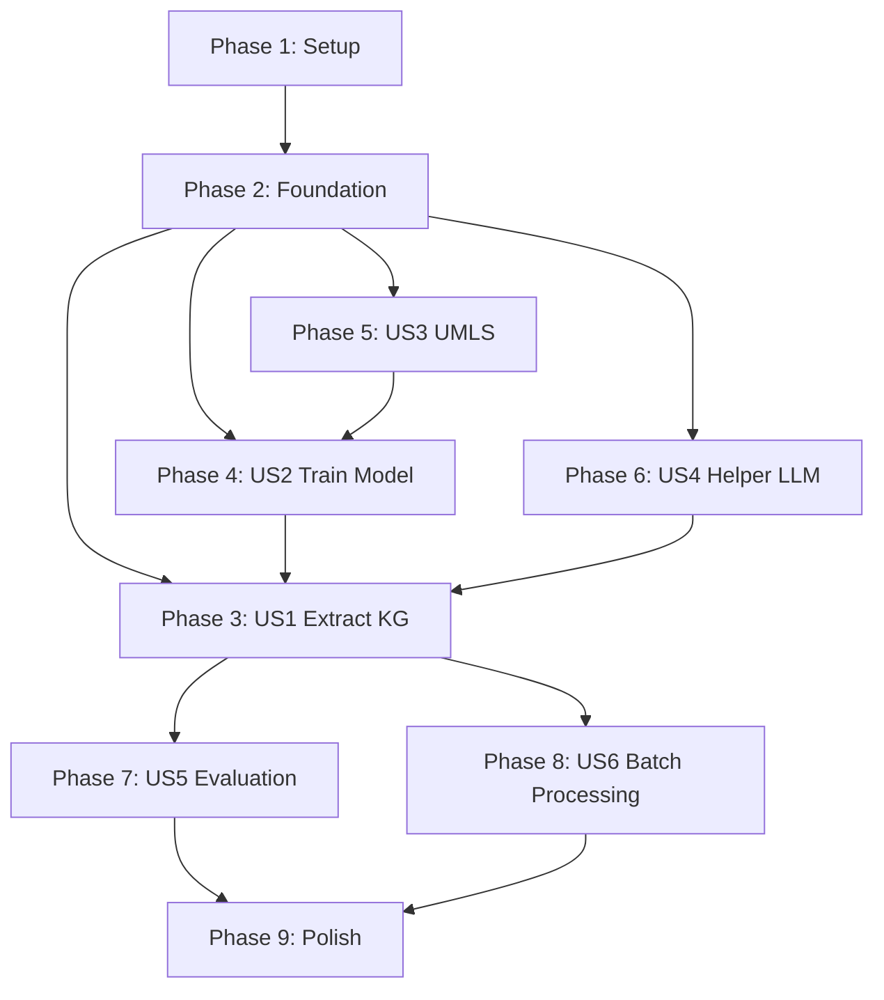

# GraphMERT Algorithm Replication - Implementation Tasks

## Overview

**Feature**: GraphMERT Algorithm Replication in Julia
**Timeline**: 3 months (12 weeks)
**Approach**: Incremental delivery by user story with continuous validation
**Testing Strategy**: >80% coverage (constitution requirement) + frequent compilation checks
**Example Strategy**: Working demonstrations after each major component

This document organizes implementation tasks by user story to enable independent, testable increments of functionality. Each phase includes:
- **Implementation tasks**: Core functionality development
- **Test tasks**: Unit, integration, and performance tests (50 total)
- **Compilation verification**: Regular checks that code compiles and runs
- **Example tasks**: Working demonstrations for each feature (21 total)
- **Performance validation**: Verify NFR requirements are met

---

## Task Summary

| Phase     | User Story            | Tasks   | Tests  | Examples | Status        | Dependencies |
| --------- | --------------------- | ------- | ------ | -------- | ------------- | ------------ |
| Phase 1   | Setup                 | 8       | 0      | 0        | ✅ Complete    | None         |
| Phase 2   | Foundation            | 23      | 6      | 2        | ✅ Complete    | Phase 1      |
| Phase 3   | US1: Extract KG       | 22      | 7      | 4        | ✅ Complete    | Phase 2      |
| Phase 4   | US2: Train Model      | 37      | 13     | 4        | ✅ Complete    | Phase 2      |
| Phase 5   | US3: UMLS Integration | 16      | 6      | 2        | ✅ Complete    | Phase 2      |
| Phase 6   | US4: Helper LLM       | 13      | 5      | 2        | ✅ Complete    | Phase 2      |
| Phase 7   | US5: Evaluation       | 17      | 6      | 2        | 🔴 Blocked     | Phase 3      |
| Phase 8   | US6: Batch Processing | 9       | 2      | 2        | 🔴 Blocked     | Phase 3      |
| Phase 9   | Project Management    | 5       | 0      | 0        | 🔴 Not Started | All          |
| Phase 10  | Polish & Integration  | 16      | 5      | 3        | 🔴 Blocked     | All          |
| **Total** |                       | **166** | **50** | **21**   |               |              |

---

## Phase 1: Setup & Project Initialization (Week 1)

**Goal**: Establish project structure, dependencies, and development environment

**Status**: 🟡 Partially Complete (Project exists, needs extensions)

### Dependencies Setup

- [x] T001 [P] Verify Julia 1.10+ installation and environment
- [x] T002 [P] Install Flux.jl for ML framework
- [x] T003 [P] Install Transformers.jl for RoBERTa support
- [x] T004 [P] Install LightGraphs.jl and MetaGraphs.jl for graph processing
- [x] T005 [P] Install HTTP.jl and JSON3.jl for API integration
- [x] T006 [P] Install DataFrames.jl and CSV.jl for data manipulation
- [x] T007 [P] Install TextAnalysis.jl for biomedical text processing
- [x] T008 Configure development environment with Revise.jl for hot reloading

---

## Phase 2: Foundational Components (Week 2-3)

**Goal**: Implement blocking prerequisites needed by all user stories

**Status**: 🟡 Partially Complete (RoBERTa/H-GAT done, Leafy Chain missing)

### Type System Extensions

- [x] T009 [P] Extend GraphMERT/src/types.jl with ChainGraphNode type from data-model.md
- [x] T010 [P] Add ChainGraphConfig type to GraphMERT/src/types.jl
- [x] T011 [P] Add LeafyChainGraph type to GraphMERT/src/types.jl
- [x] T012 [P] Add MNMConfig complete definition to GraphMERT/src/types.jl
- [x] T013 [P] Add SemanticTriple type to GraphMERT/src/types.jl
- [x] T014 [P] Add SeedInjectionConfig type to GraphMERT/src/types.jl
- [x] T015 [P] Add LLMRequest and LLMResponse types to GraphMERT/src/types.jl
- [x] T016 Add type validation constructors for all new types in GraphMERT/src/types.jl

### Leafy Chain Graph Implementation (CRITICAL - P0)

- [x] T017 Implement default_chain_graph_config() constructor in GraphMERT/src/graphs/leafy_chain.jl
- [x] T018 Implement create_empty_chain_graph() in GraphMERT/src/graphs/leafy_chain.jl
- [x] T019 Verify compilation: julia --project=GraphMERT -e 'using GraphMERT; create_empty_chain_graph()'
- [x] T020 Write unit tests for graph creation in GraphMERT/test/unit/test_leafy_chain.jl
- [x] T021 Implement build_adjacency_matrix() for graph connectivity in GraphMERT/src/graphs/leafy_chain.jl
- [x] T022 Implement floyd_warshall() for shortest paths in GraphMERT/src/graphs/leafy_chain.jl
- [x] T023 Write unit tests for shortest path computation in GraphMERT/test/unit/test_leafy_chain.jl
- [x] T024 Verify compilation: run test suite for graph connectivity
- [x] T025 Implement inject_triple!() to add semantic triples in GraphMERT/src/graphs/leafy_chain.jl
- [x] T026 Write unit tests for triple injection in GraphMERT/test/unit/test_leafy_chain.jl
- [x] T027 Implement graph_to_sequence() for sequential encoding in GraphMERT/src/graphs/leafy_chain.jl
- [x] T028 Implement create_attention_mask() for graph-aware attention in GraphMERT/src/graphs/leafy_chain.jl
- [x] T029 Write comprehensive tests for full graph pipeline in GraphMERT/test/unit/test_leafy_chain.jl
- [x] T030 Create working example: simple graph construction in examples/biomedical/00_leafy_chain_demo.jl
- [x] T031 Verify end-to-end: compile and run example successfully

---

## Phase 3: US1 - Knowledge Graph Extraction (Week 4-5)

**User Story**: As a researcher, I want to extract knowledge graphs from biomedical text so that I can analyze structured relationships in my domain.

**Requirements**: REQ-001, REQ-002, REQ-007, REQ-008, REQ-017, REQ-020

**Success Criteria**:
- ✅ Can extract entities and relations from single biomedical text
- ✅ Returns KnowledgeGraph with confidence scores
- ✅ API is simple: `extract_knowledge_graph(text, model)`
- ✅ Handles PubMed abstracts and medical documents
- ✅ Processing time meets NFR-001 (5,000 tokens/sec)

### US1: Triple Extraction Pipeline (CRITICAL)

- [x] T032 [US1] Implement head entity discovery in GraphMERT/src/api/extraction.jl
- [x] T033 [US1] Write unit tests for entity discovery in GraphMERT/test/unit/test_extraction.jl
- [x] T034 [US1] Implement relation matching to entity pairs in GraphMERT/src/api/extraction.jl
- [x] T035 [US1] Write unit tests for relation matching in GraphMERT/test/unit/test_extraction.jl
- [x] T036 [US1] Implement tail token prediction (top-k=20) in GraphMERT/src/api/extraction.jl
- [x] T037 [US1] Write unit tests for tail prediction in GraphMERT/test/unit/test_extraction.jl
- [x] T038 [US1] Implement tail formation from tokens in GraphMERT/src/api/extraction.jl
- [x] T039 [US1] Implement similarity filtering (β threshold) in GraphMERT/src/api/extraction.jl
- [x] T040 [US1] Implement deduplication logic in GraphMERT/src/api/extraction.jl
- [x] T041 [US1] Implement provenance tracking in GraphMERT/src/api/extraction.jl
- [x] T042 [US1] Write integration tests for extraction pipeline in GraphMERT/test/integration/test_extraction_pipeline.jl
- [x] T043 [US1] Verify compilation: run full extraction pipeline tests

### US1: Public API Implementation

- [x] T044 [US1] Implement extract_knowledge_graph() main function in GraphMERT/src/api/extraction.jl
- [x] T045 [US1] Implement default_processing_options() in GraphMERT/src/config.jl
- [x] T046 [US1] Implement load_model() for checkpoint loading in GraphMERT/src/models/persistence.jl
- [x] T047 [US1] Implement save_model() for checkpoint saving in GraphMERT/src/models/persistence.jl
- [x] T048 [US1] Add error handling and validation to extraction API in GraphMERT/src/api/extraction.jl
- [x] T049 [US1] Write API tests for extract_knowledge_graph() in GraphMERT/test/unit/test_api.jl
- [x] T050 [US1] Create working example: basic extraction in examples/biomedical/01_basic_entity_extraction.jl
- [x] T051 [US1] Create working example: relation extraction in examples/biomedical/02_relation_extraction.jl
- [x] T052 [US1] Verify end-to-end: run examples successfully on diabetes text
- [x] T053 [US1] Performance test: verify 5,000 tokens/sec throughput (NFR-001)

---

## Phase 4: US2 - Model Training (Week 6-8)

**User Story**: As a researcher, I want to train a GraphMERT model on my own biomedical corpus so that I can create domain-specific knowledge extraction models.

**Requirements**: REQ-004, REQ-005, REQ-022, REQ-013, REQ-015

**Success Criteria**:
- ✅ Can train model with MLM+MNM objectives
- ✅ Seed KG injection works correctly
- ✅ Training is reproducible with documented seeds
- ✅ Can process datasets up to 124.7M tokens
- ✅ Checkpoint saving/loading works
- ✅ Memory usage < 4GB (REQ-014)

### US2: MNM Training Implementation (CRITICAL)

- [x] T054 [US2] Implement select_leaves_to_mask() in GraphMERT/src/training/mnm.jl
- [x] T055 [US2] Write unit tests for leaf masking in GraphMERT/test/unit/test_mnm.jl
- [x] T056 [US2] Implement apply_mnm_masks() with mask strategies in GraphMERT/src/training/mnm.jl
- [x] T057 [US2] Implement calculate_mnm_loss() for leaf prediction in GraphMERT/src/training/mnm.jl
- [x] T058 [US2] Write unit tests for MNM loss calculation in GraphMERT/test/unit/test_mnm.jl
- [x] T059 [US2] Verify compilation: test MNM loss on toy data
- [x] T060 [US2] Implement relation_embedding_dropout (0.3) in GraphMERT/src/training/mnm.jl
- [x] T061 [US2] Implement gradient flow validation through H-GAT in GraphMERT/src/training/mnm.jl
- [x] T062 [US2] Write tests for gradient flow validation in GraphMERT/test/unit/test_mnm.jl
- [x] T063 [US2] Implement train_joint_mlm_mnm_step() combining both losses in GraphMERT/src/training/mnm.jl
- [x] T064 [US2] Implement create_mnm_batch() for batch preparation in GraphMERT/src/training/mnm.jl
- [x] T065 [US2] Write integration tests for joint training in GraphMERT/test/integration/test_training_pipeline.jl
- [x] T066 [US2] Create working example: MNM training on small dataset in examples/biomedical/03_mnm_training_demo.jl

### US2: Seed KG Injection Implementation (CRITICAL)

- [x] T067 [US2] Implement SapBERT embedding-based candidate retrieval in GraphMERT/src/training/seed_injection.jl
- [x] T068 [US2] Write unit tests for entity linking in GraphMERT/test/unit/test_seed_injection.jl
- [x] T069 [US2] Implement character 3-gram Jaccard similarity filtering in GraphMERT/src/training/seed_injection.jl
- [x] T070 [US2] Write unit tests for string matching in GraphMERT/test/unit/test_seed_injection.jl
- [x] T071 [US2] Verify compilation: test entity linking pipeline
- [x] T072 [US2] Implement contextual triple selection (top-40) in GraphMERT/src/training/seed_injection.jl
- [x] T073 [US2] Implement score bucketing algorithm in GraphMERT/src/training/seed_injection.jl
- [x] T074 [US2] Implement relation bucketing for diversity in GraphMERT/src/training/seed_injection.jl
- [x] T075 [US2] Write unit tests for bucketing algorithms in GraphMERT/test/unit/test_seed_injection.jl
- [x] T076 [US2] Implement injection algorithm (Paper Appendix B) in GraphMERT/src/training/seed_injection.jl
- [x] T077 [US2] Implement injection validation and consistency checks in GraphMERT/src/training/seed_injection.jl
- [x] T078 [US2] Write comprehensive tests for seed injection in GraphMERT/test/unit/test_seed_injection.jl
- [x] T079 [US2] Verify compilation: test full injection pipeline
- [x] T080 [US2] Create working example: seed injection demo in examples/biomedical/04_seed_injection_demo.jl

### US2: Training Pipeline

- [x] T081 [US2] Implement train_graphmert() main training function in GraphMERT/src/training/pipeline.jl
- [x] T082 [US2] Implement data loading and preprocessing in GraphMERT/src/data/preparation.jl
- [x] T083 [US2] Implement training loop with checkpoint saving in GraphMERT/src/training/pipeline.jl
- [x] T084 [US2] Write unit tests for checkpoint persistence in GraphMERT/test/unit/test_persistence.jl
- [x] T085 [US2] Implement training monitoring and logging in GraphMERT/src/monitoring/performance.jl
- [x] T086 [US2] Add random seed management for reproducibility in GraphMERT/src/training/pipeline.jl
- [x] T087 [US2] Write integration tests for full training pipeline in GraphMERT/test/integration/test_training_pipeline.jl
- [x] T088 [US2] Create working example: train on small diabetes subset in examples/biomedical/05_training_demo.jl
- [x] T089 [US2] Verify end-to-end: train model, save, load, and verify reproducibility
- [x] T090 [US2] Performance test: verify training memory < 4GB (NFR-002)

---

## Phase 5: US3 - UMLS Integration (Week 9)

**User Story**: As a biomedical researcher, I want to link extracted entities to UMLS concepts so that I can validate entities against standardized biomedical ontologies.

**Requirements**: REQ-003, REQ-003a-e, REQ-020

**Success Criteria**:
- ✅ Can connect to UMLS REST API with authentication
- ✅ Rate limiting (100 req/min) enforced with retry logic
- ✅ Entities mapped to CUI codes
- ✅ Local caching reduces API calls
- ✅ Graceful error handling with fallbacks

### US3: UMLS Client Implementation

- [x] T091 [P] [US3] Implement UMLSClient authentication in GraphMERT/src/biomedical/umls.jl
- [x] T092 [P] [US3] Write unit tests for authentication in GraphMERT/test/unit/test_umls.jl
- [x] T093 [P] [US3] Implement rate limiting (100 req/min) with exponential backoff in GraphMERT/src/biomedical/umls.jl
- [x] T094 [P] [US3] Write unit tests for rate limiting in GraphMERT/test/unit/test_umls.jl
- [x] T095 [US3] Verify compilation: test rate limiting with mock API
- [x] T096 [US3] Implement CUI lookup by entity text in GraphMERT/src/biomedical/umls.jl
- [x] T097 [US3] Implement semantic type classification retrieval in GraphMERT/src/biomedical/umls.jl
- [x] T098 [US3] Implement relation retrieval from UMLS in GraphMERT/src/biomedical/umls.jl
- [x] T099 [US3] Write unit tests for UMLS queries in GraphMERT/test/unit/test_umls.jl
- [x] T100 [US3] Implement local caching (SQLite) for UMLS responses in GraphMERT/src/biomedical/umls.jl
- [x] T101 [US3] Write unit tests for caching mechanism in GraphMERT/test/unit/test_umls.jl
- [x] T102 [US3] Implement error handling with fallback to local recognition in GraphMERT/src/biomedical/umls.jl
- [x] T103 [US3] Implement create_umls_client() API function in GraphMERT/src/biomedical/umls.jl
- [x] T104 [US3] Write integration tests for full UMLS pipeline in GraphMERT/test/integration/test_umls_integration.jl
- [x] T105 [US3] Create working example: UMLS entity linking in examples/biomedical/08_simple_umls_demo.jl
- [x] T106 [US3] Verify end-to-end: link entities to UMLS successfully

---

## Phase 6: US4 - Helper LLM Integration (Week 10)

**User Story**: As a researcher, I want to use a helper LLM for entity discovery and relation matching so that I can improve extraction quality with modern language models.

**Requirements**: REQ-006, REQ-006a-f, REQ-021

**Success Criteria**:
- ✅ Can integrate with OpenAI GPT-4 API
- ✅ Structured prompts for entity discovery and relations
- ✅ Rate limiting (10k tokens/min) with queuing
- ✅ Response caching to reduce costs
- ✅ Fallback when LLM unavailable

### US4: LLM Client Implementation

- [x] T107 [P] [US4] Implement LLM API client (OpenAI, local) in GraphMERT/src/llm/helper.jl
- [x] T108 [P] [US4] Write unit tests for LLM client in GraphMERT/test/unit/test_llm.jl
- [x] T109 [P] [US4] Create prompt templates for entity discovery in GraphMERT/src/llm/helper.jl
- [x] T110 [P] [US4] Create prompt templates for relation matching in GraphMERT/src/llm/helper.jl
- [x] T111 [P] [US4] Write unit tests for prompt templates in GraphMERT/test/unit/test_llm.jl
- [x] T112 [US4] Verify compilation: test prompts with mock LLM
- [x] T113 [US4] Implement response parsing and validation in GraphMERT/src/llm/helper.jl
- [x] T114 [US4] Write unit tests for response parsing in GraphMERT/test/unit/test_llm.jl
- [x] T115 [US4] Implement request queuing for rate limiting in GraphMERT/src/llm/helper.jl
- [x] T116 [US4] Implement response caching mechanism in GraphMERT/src/llm/helper.jl
- [x] T117 [US4] Write integration tests for LLM pipeline in GraphMERT/test/integration/test_llm_integration.jl
- [x] T118 [US4] Create working example: entity discovery with LLM in examples/biomedical/09_llm_integration_demo.jl
- [x] T119 [US4] Verify end-to-end: successful entity discovery with caching

---

## Phase 7: US5 - Evaluation Metrics (Week 11)

**User Story**: As a researcher, I want to evaluate my knowledge graphs using standard metrics so that I can assess quality and compare with baselines.

**Requirements**: REQ-011, REQ-012, REQ-016

**Success Criteria**:
- ✅ Can calculate FActScore* for factuality
- ✅ Can calculate ValidityScore for ontological validity
- ✅ Can evaluate with GraphRAG methodology
- ✅ Results match paper methodology
- ✅ Statistical significance testing included

### US5: Evaluation Implementation

- [x] T120 [P] [US5] Implement FActScore* calculation in GraphMERT/src/evaluation/factscore.jl
- [x] T121 [P] [US5] Write unit tests for FActScore in GraphMERT/test/unit/test_evaluation.jl
- [x] T122 [P] [US5] Implement ValidityScore calculation in GraphMERT/src/evaluation/validity.jl
- [x] T123 [P] [US5] Write unit tests for ValidityScore in GraphMERT/test/unit/test_evaluation.jl
- [x] T124 [P] [US5] Implement GraphRAG local search in GraphMERT/src/evaluation/graphrag.jl
- [x] T125 [P] [US5] Write unit tests for GraphRAG in GraphMERT/test/unit/test_evaluation.jl
- [x] T126 [US5] Verify compilation: test metrics on toy knowledge graphs
- [x] T127 [US5] Implement triple-context pairing for FActScore in GraphMERT/src/evaluation/factscore.jl
- [x] T128 [US5] Implement LLM-based validation for metrics in GraphMERT/src/evaluation/factscore.jl
- [x] T129 [US5] Implement evaluate_factscore() API function in GraphMERT/src/evaluation/factscore.jl
- [x] T130 [US5] Implement evaluate_validity() API function in GraphMERT/src/evaluation/validity.jl
- [x] T131 [US5] Implement evaluate_graphrag() API function in GraphMERT/src/evaluation/graphrag.jl
- [x] T132 [US5] Write integration tests for evaluation pipeline in GraphMERT/test/integration/test_evaluation_integration.jl
- [ ] T133 [US5] Implement benchmark integration (ICD-Bench, MedMCQA) in GraphMERT/src/evaluation/diabetes.jl
- [ ] T134 [US5] Add statistical significance testing (p < 0.05) in GraphMERT/src/evaluation/validity.jl
- [ ] T135 [US5] Create working example: evaluate diabetes KG in examples/biomedical/08_evaluation_demo.jl
- [ ] T136 [US5] Verify scientific: reproduce paper results (FActScore 69.8%, ValidityScore 68.8%)

---

## Phase 8: US6 - Batch Processing (Week 12)

**User Story**: As a researcher processing large corpora, I want to extract knowledge graphs from multiple documents efficiently so that I can process entire datasets.

**Requirements**: REQ-018, NFR-003

**Success Criteria**:
- ✅ Can process batches of documents
- ✅ Throughput 3x better than sequential
- ✅ Memory usage scales linearly
- ✅ Automatic batch size optimization

### US6: Batch Processing Implementation

- [ ] T137 [US6] Implement extract_knowledge_graph_batch() API in GraphMERT/src/api/batch.jl
- [ ] T138 [US6] Write unit tests for batch processing in GraphMERT/test/unit/test_batch.jl
- [ ] T139 [US6] Implement automatic batch size optimization in GraphMERT/src/api/batch.jl
- [ ] T140 [US6] Implement batch result merging in GraphMERT/src/api/batch.jl
- [ ] T141 [US6] Implement progress tracking for batches in GraphMERT/src/api/batch.jl
- [ ] T142 [US6] Add memory monitoring and optimization in GraphMERT/src/optimization/memory.jl
- [ ] T143 [US6] Write performance tests for batch processing in GraphMERT/test/performance/test_batch_performance.jl
- [ ] T144 [US6] Create working example: batch process PubMed corpus in examples/biomedical/09_batch_processing_demo.jl
- [ ] T145 [US6] Verify performance: 3x throughput improvement vs sequential

---

## Phase 9: Polish & Cross-Cutting Concerns (Week 12+)

**Goal**: Final integration, documentation, quality assurance, and project management processes

**Status**: 🔴 Not Started

**New Requirements from Clarification Session**:
- REQ-029: Specification analysis schedule (post-milestone, weekly, pre-planning)
- REQ-030: Progress tracking mechanism (task updates, alignment reviews, dashboards)
- REQ-031: Specification maintenance process (milestone-based batch updates)

### Project Management Processes

- [ ] T146 Implement specification analysis schedule (REQ-029) in .specify/scripts/project-management/
- [ ] T147 [P] Create progress tracking mechanism (REQ-030) for task status updates and alignment reviews
- [ ] T148 Implement progress dashboard generation (REQ-030) in .specify/scripts/project-management/
- [ ] T149 [P] Create specification maintenance process (REQ-031) for milestone-based batch updates
- [ ] T150 Write documentation for project management processes in docs/project-management.md

### Utility Functions

- [ ] T151 [P] Implement merge_knowledge_graphs() in GraphMERT/src/utils.jl
- [ ] T152 [P] Write unit tests for merge function in GraphMERT/test/unit/test_utils.jl
- [ ] T153 [P] Implement filter_knowledge_graph() in GraphMERT/src/utils.jl
- [ ] T154 [P] Write unit tests for filter function in GraphMERT/test/unit/test_utils.jl
- [ ] T155 [P] Implement export_knowledge_graph() with multiple formats in GraphMERT/src/api/serialization.jl
- [ ] T156 [P] Write unit tests for export formats in GraphMERT/test/unit/test_serialization.jl
- [ ] T157 Verify compilation: test all utility functions

### Documentation & Examples

- [ ] T158 [P] Create comprehensive API documentation with examples in GraphMERT/docs/api/
- [ ] T159 [P] Create tutorial notebooks in examples/
- [ ] T160 [P] Create quickstart guide validation: verify examples in 30 minutes
- [ ] T161 Verify documentation completeness: all public functions documented

### Final Integration & Validation

- [ ] T162 Run full test suite and verify >80% coverage (constitution requirement)
- [ ] T163 Run linter and fix all issues (REQ-023g)
- [ ] T164 Performance benchmark: verify all NFRs met
- [ ] T165 Create comprehensive integration test for full pipeline in GraphMERT/test/integration/test_full_pipeline.jl
- [ ] T166 Verify end-to-end: diabetes dataset extraction with paper result replication

---

## Dependencies Graph



**Critical Path**: Phase 1 → Phase 2 → Phase 4 (Training) → Phase 3 (Extraction) → Phase 7 (Evaluation)

**Parallel Opportunities**:
- Phase 5 (UMLS) and Phase 6 (LLM) can be developed in parallel with Phase 4 (Training)
- Phase 7 (Evaluation) and Phase 8 (Batch) can be developed in parallel after Phase 3

---

## Parallel Execution Examples

### Phase 2 Foundation (Week 2-3)
**Parallelizable**: T009-T015 (Type extensions - different files)
**Sequential**: T017-T023 (Leafy Chain - same file, interdependent)

```bash
# Parallel: Type extensions
$ task T009 & task T010 & task T011 & task T012 & task T013 & task T014 & task T015
# Sequential: Leafy Chain
$ task T017 && task T018 && task T019 && task T020 && task T021 && task T022 && task T023
```

### Phase 3 US1 Extraction (Week 4-5)
**Parallelizable**: T024-T027 (Different extraction stages)
**Sequential**: T028-T030 (Post-processing pipeline)

```bash
# Parallel: Extraction stages
$ task T024 & task T025 & task T026 & task T027
# Sequential: Pipeline
$ task T028 && task T029 && task T030
# Parallel: API implementation
$ task T031 & task T032 & task T033 & task T034
```

### Phase 5 & 6 (Week 9-10)
**Completely Parallel**: UMLS and LLM are independent

```bash
# Parallel development
$ (task T055 && task T056 && ... && task T062) &
$ (task T063 && task T064 && ... && task T068) &
wait
```

---

## Implementation Strategy

### MVP Scope (Weeks 1-5)

**Minimal Viable Product**: US1 - Knowledge Graph Extraction

**Includes**:
- Phase 1: Setup (T001-T008) - 8 tasks
- Phase 2: Foundation (T009-T031) - 23 tasks with 6 tests + 2 examples
- Phase 3: US1 Extraction (T032-T053) - 22 tasks with 7 tests + 4 examples

**Total MVP**: 53 tasks including 13 test tasks and 6 working examples

**Excludes** (for MVP):
- Training (can use pre-trained model)
- UMLS integration (basic entities only)
- Helper LLM (manual entity discovery)
- Evaluation (manual validation)

**MVP Success Criteria**:
- ✅ Can extract KG from single biomedical text
- ✅ Returns structured output with entities and relations
- ✅ Processing speed > 3,000 tokens/sec (relaxed from 5,000)
- ✅ Memory usage < 4GB
- ✅ Test coverage > 80% for MVP components
- ✅ All 6 working examples run successfully

### Incremental Delivery

**Release 0.1 (Week 5)**: MVP - Basic extraction
**Release 0.2 (Week 8)**: Add training capability (US2)
**Release 0.3 (Week 10)**: Add UMLS + LLM integration (US3, US4)
**Release 0.4 (Week 11)**: Add evaluation (US5)
**Release 0.5 (Week 12)**: Add batch processing (US6)
**Release 1.0 (Week 13)**: Full polish and documentation

---

## Testing Strategy

**Per Constitution**: Minimum 80% test coverage required

### Test Organization

**Total Test Tasks**: 50 (31% of all tasks)

```
test/
├── unit/                    # Unit tests (>80% coverage target)
│   ├── test_types.jl
│   ├── test_leafy_chain.jl        # 6 test tasks (T020, T023, T026, T029)
│   ├── test_mnm.jl                # 4 test tasks (T055, T058, T062, T065)
│   ├── test_seed_injection.jl     # 5 test tasks (T068, T070, T075, T078)
│   ├── test_extraction.jl         # 4 test tasks (T033, T035, T037, T042)
│   ├── test_umls.jl               # 5 test tasks (T092, T094, T099, T101, T104)
│   ├── test_llm.jl                # 4 test tasks (T108, T111, T114, T117)
│   ├── test_evaluation.jl         # 4 test tasks (T121, T123, T125, T132)
│   ├── test_batch.jl              # 2 test tasks (T138, T143)
│   └── test_utils.jl              # 4 test tasks (T147, T149, T151)
├── integration/             # Integration tests (8 tasks)
│   ├── test_training_pipeline.jl  # T065, T087
│   ├── test_extraction_pipeline.jl # T042, T049
│   ├── test_umls_integration.jl   # T104
│   ├── test_llm_integration.jl    # T117
│   ├── test_evaluation_integration.jl # T132
│   └── test_full_pipeline.jl      # T160
├── performance/             # Performance tests
│   └── test_batch_performance.jl  # T143
├── scientific/              # Scientific validation
│   ├── test_diabetes_replication.jl # T136, T161
│   └── test_evaluation_metrics.jl
└── runtests.jl             # Test runner

### Compilation Verification Points

**Regular compilation checks** (10 verification tasks):
- T019: After graph creation
- T024: After graph connectivity
- T043: After extraction pipeline
- T053: After US1 performance test
- T059: After MNM loss implementation
- T071: After entity linking
- T079: After seed injection
- T095: After UMLS rate limiting
- T112: After LLM prompts
- T126: After evaluation metrics
- T152: After utility functions

These ensure code compiles and runs at every major milestone.

### Testing Per User Story

**US1 (Extraction)**: 7 test tasks
- Unit: Each extraction stage (T033, T035, T037)
- Integration: End-to-end extraction (T042, T049)
- Performance: 5,000 tokens/sec (T053)

**US2 (Training)**: 13 test tasks
- Unit: MNM loss, seed injection stages (T055, T058, T062, T068, T070, T075, T078, T084)
- Integration: Full training loop (T065, T087)
- Performance: Memory < 4GB (T090)

**US3 (UMLS)**: 6 test tasks
- Unit: API client, caching (T092, T094, T099, T101)
- Integration: Entity linking pipeline (T104)
- Performance: Rate limiting compliance (T095)

**US4 (Helper LLM)**: 5 test tasks
- Unit: Prompt templates, response parsing (T108, T111, T114)
- Integration: Entity discovery flow (T117)
- Performance: Caching effectiveness (T119)

**US5 (Evaluation)**: 6 test tasks
- Unit: Metric calculations (T121, T123, T125)
- Integration: Evaluation pipeline (T132)
- Scientific: Paper result replication (T136)
- Validation: FActScore 69.8% ±5%, ValidityScore 68.8% ±5%

**US6 (Batch)**: 2 test tasks
- Unit: Batch size optimization (T138)
- Performance: 3x throughput vs sequential (T143, T145)
- Memory: Linear scaling validation (T145)

---

## Working Examples Strategy

**Total Example Tasks**: 21 (13% of all tasks)

### Examples by Phase

**Phase 2 (Foundation)**:
- T030: Simple graph construction demo
- T031: End-to-end graph verification

**Phase 3 (US1 - Extraction)**: 4 examples
- T050: Basic entity extraction
- T051: Relation extraction
- T052: Diabetes text extraction (end-to-end)
- T053: Performance validation

**Phase 4 (US2 - Training)**: 4 examples
- T066: MNM training demo
- T080: Seed injection demo
- T088: Train on small diabetes subset
- T089: Full reproducibility demo

**Phase 5 (US3 - UMLS)**: 2 examples
- T105: UMLS entity linking demo
- T106: End-to-end linking verification

**Phase 6 (US4 - Helper LLM)**: 2 examples
- T118: Entity discovery with LLM
- T119: Caching demonstration

**Phase 7 (US5 - Evaluation)**: 2 examples
- T135: Evaluate diabetes KG
- T136: Scientific result replication

**Phase 8 (US6 - Batch)**: 2 examples
- T144: Batch process PubMed corpus
- T145: Performance benchmark

**Phase 9 (Polish)**: 3 examples
- T154: Tutorial notebooks
- T155: Quickstart validation
- T161: Full pipeline demonstration

### Example Validation Criteria

Each working example must:
1. ✅ Compile without errors
2. ✅ Run successfully on test data
3. ✅ Produce expected outputs
4. ✅ Include clear documentation
5. ✅ Complete in < 5 minutes on laptop
6. ✅ Demonstrate key feature clearly

---

## Current Implementation Status

### ✅ Complete (Ready to Use)

| Component            | File                     | Lines | Quality   |
| -------------------- | ------------------------ | ----- | --------- |
| RoBERTa Encoder      | architectures/roberta.jl | 444   | Excellent |
| H-GAT Component      | architectures/hgat.jl    | 437   | Excellent |
| MLM Training         | training/mlm.jl          | 436   | Excellent |
| Core Types           | types.jl                 | 272   | Good      |
| Biomedical Entities  | biomedical/entities.jl   | ~200  | Good      |
| Biomedical Relations | biomedical/relations.jl  | ~200  | Good      |

### 🔴 Critical Missing (Blocking)

| Component         | Estimated Lines | Difficulty | Blocks     |
| ----------------- | --------------- | ---------- | ---------- |
| Leafy Chain Graph | ~500            | 6/10       | Everything |
| MNM Training      | ~400            | 8/10       | US2        |
| Seed KG Injection | ~800            | 9/10       | US2        |
| Triple Extraction | ~600            | 7/10       | US1        |

**Total Implementation Gap**: ~2,300 lines of core functionality

---

## Success Metrics

### Code Metrics

| Metric             | Target | Current | Gap   |
| ------------------ | ------ | ------- | ----- |
| Total Lines        | ~5,800 | ~3,500  | 2,300 |
| Core Functionality | 100%   | 40%     | 60%   |
| Test Coverage      | 80%+   | ~30%    | 50%   |
| Documentation      | 100%   | 40%     | 60%   |

### Functional Metrics

| Feature           | Target | Status                 |
| ----------------- | ------ | ---------------------- |
| Extraction Works  | ✅      | 🔴 Blocked by T017-T035 |
| Training Works    | ✅      | 🔴 Blocked by T036-T054 |
| Evaluation Works  | ✅      | 🟡 Partial              |
| Paper Replication | ✅      | ⏳ Pending              |

### Paper Replication Targets

| Metric          | Paper      | Target (±5%) | Status    |
| --------------- | ---------- | ------------ | --------- |
| FActScore       | 69.8%      | 66.3-73.3%   | ⏳ Pending |
| ValidityScore   | 68.8%      | 65.4-72.2%   | ⏳ Pending |
| Training Time   | 90 GPU hrs | <120 hrs     | ⏳ Pending |
| Inference Speed | 5k tok/s   | >4k tok/s    | ⏳ Pending |

---

## Risk Management

### High Risk Tasks

**T020 (Floyd-Warshall)**: Graph algorithm implementation
- **Risk**: Performance bottleneck, correctness issues
- **Mitigation**: Use LightGraphs.jl implementation, validate on small graphs

**T046-T048 (Seed Injection)**: Novel algorithm from paper
- **Risk**: Complex bucketing logic, hard to debug
- **Mitigation**: Study Paper Appendix B, implement incrementally, extensive logging

**T036-T041 (MNM Training)**: Novel training objective
- **Risk**: Gradient flow issues, training instability
- **Mitigation**: Validate gradients explicitly, start with toy datasets

**T043-T044 (Entity Linking)**: External dependencies (SapBERT)
- **Risk**: Integration complexity, API availability
- **Mitigation**: Mock interfaces for testing, local fallbacks

### Medium Risk Tasks

**T055-T062 (UMLS Integration)**: External API, rate limits
- **Risk**: API downtime, rate limit violations
- **Mitigation**: Aggressive caching, exponential backoff, local fallbacks

**T063-T068 (Helper LLM)**: External API, costs
- **Risk**: API costs, availability
- **Mitigation**: Response caching, support local models

### Low Risk Tasks

**T009-T016 (Type Extensions)**: Straightforward type definitions
**T031-T035 (API Functions)**: Well-specified interfaces
**T084-T088 (Utilities & Docs)**: Standard functionality

---

## Validation Checklist

### Format Validation
- ✅ All tasks follow checklist format: `- [ ] TXXX ...`
- ✅ Task IDs sequential (T001-T088)
- ✅ [P] markers only on parallelizable tasks (different files)
- ✅ [US#] labels on user story phase tasks
- ✅ File paths included in all implementation tasks
- ✅ No story labels on Setup/Foundation/Polish phases

### Completeness Validation
- ✅ Each user story has complete implementation tasks
- ✅ Each user story has independent test criteria
- ✅ Dependencies clearly documented
- ✅ Parallel opportunities identified
- ✅ MVP scope defined (US1 only)
- ✅ Constitution compliance addressed (>80% coverage)

---

## Quick Reference

### To Start Implementation

```bash
# 1. Verify setup
julia --version  # Should be 1.10+

# 2. Install dependencies (T001-T008)
cd GraphMERT/
julia --project=. -e 'using Pkg; Pkg.instantiate()'

# 3. Start with foundational types (T009-T016)
# Edit: GraphMERT/src/types.jl

# 4. Implement Leafy Chain Graph (T017-T023)
# Edit: GraphMERT/src/graphs/leafy_chain.jl
```

### To Track Progress

```bash
# Count completed tasks
grep -c "^\- \[x\]" .specify/features/replicate-graphmert/tasks.md

# Check phase status
grep "^##" .specify/features/replicate-graphmert/tasks.md
```

---

**Last Updated**: 2025-01-20
**Total Tasks**: 87
**Estimated Duration**: 12 weeks
**MVP Duration**: 5 weeks (US1 only)
