# GraphMERT Implementation Roadmap

## Practical Implementation Priorities and Current State

**Document Version**: 1.0
**Last Updated**: 2025-01-20
**Companion To**: `00-INDEX.md` (logical organization)

---

## Purpose

This document provides **practical implementation guidance** based on:

- **Current state** of the codebase
- **Dependencies** between components
- **Complexity** and effort estimates
- **Testing** requirements
- **Critical path** for working system

While the main specification (`00-INDEX.md`) is organized logically to understand how GraphMERT works, this roadmap is organized **pragmatically** for efficient implementation.

---

## Current Implementation Status

### ✅ Complete and Working (Good Foundation)

| Component | File | Lines | Status | Quality |
|-----------|------|-------|--------|---------|
| RoBERTa Encoder | `architectures/roberta.jl` | 444 | ✅ | Excellent |
| H-GAT Component | `architectures/hgat.jl` | 437 | ✅ | Excellent |
| MLM Training | `training/mlm.jl` | 436 | ✅ | Excellent |
| Core Types | `types.jl` | 272 | ✅ | Good |
| Biomedical Entities | `biomedical/entities.jl` | ? | ✅ | Good |
| Biomedical Relations | `biomedical/relations.jl` | ? | ✅ | Good |

**Assessment**: Strong foundation for transformer-based architecture. The core ML components (RoBERTa, H-GAT, MLM) are well-implemented.

---

### 🔴 Critical Missing (Blocks Progress)

| Component | File | Lines | Status | Impact |
|-----------|------|-------|--------|--------|
| Leafy Chain Graph | `graphs/leafy_chain.jl` | 30 | 🔴 Stub | **BLOCKING** |
| MNM Training | `training/mnm.jl` | 30 | 🔴 Stub | **BLOCKING** |
| Seed Injection | `training/seed_injection.jl` | 19 | 🔴 Stub | **BLOCKING** |
| Training Pipeline | `training/pipeline.jl` | 19 | 🔴 Stub | **BLOCKING** |
| Triple Extraction | `api/extraction.jl` | ? | 🔴 Partial | High |

**Assessment**: These are the **critical path** components. System cannot function without them.

---

### 🟡 Partial or Needs Enhancement

| Component | File | Status | Notes |
|-----------|------|--------|-------|
| Attention Mechanisms | Embedded in `hgat.jl` | 🟡 | Needs extraction/documentation |
| Graph Encodings | Various | 🟡 | Scattered, needs consolidation |
| UMLS Integration | `biomedical/umls.jl` | 🟡 | Basic structure, needs full API |
| Helper LLM | `llm/helper.jl` | 🟡 | Stub, needs implementation |
| Evaluation | `evaluation/*.jl` | 🟡 | Partial implementations |

---

## Implementation Phases

### Phase 1: Foundation (Week 1-2) - CRITICAL PATH

**Goal**: Establish the foundational data structures that everything else depends on.

#### 1.1 Leafy Chain Graph Structure → [Doc 02](02-leafy-chain-graphs.md)

**Priority**: P0 (BLOCKING ALL OTHER WORK)
**Complexity**: Medium
**Effort**: 3-5 days
**File**: `GraphMERT/src/graphs/leafy_chain.jl`

**Required Features**:

- [ ] Define `LeafyChainGraph` type with proper structure
- [ ] Root node representation (syntactic space)
- [ ] Leaf node representation (semantic space)
- [ ] Edge connectivity (root-to-leaf, leaf-to-leaf)
- [ ] Sequential encoding (graph → 1D sequence)
- [ ] Fixed-size constraints (128 roots, 7 leaves per root)
- [ ] Padding mechanisms
- [ ] Graph construction from text tokens
- [ ] Injection point identification

**Dependencies**: None (foundational)
**Blocks**: Everything else

**Testing**:

```julia
@testset "LeafyChainGraph" begin
    # Test graph construction from tokens
    # Test sequential encoding
    # Test leaf injection
    # Test padding
    # Test fixed-size constraints
end
```

**Success Criteria**:

- Can create chain graph from text sequence
- Can encode as 1024-token sequence (128 roots × 7 leaves + roots)
- Can inject semantic triples into leaf positions
- All structural constraints satisfied

---

#### 1.2 Enhanced Type Definitions → [Doc 11](11-data-structures.md)

**Priority**: P0
**Complexity**: Low
**Effort**: 1-2 days
**File**: `GraphMERT/src/types.jl`

**Required Additions**:

- [ ] `LeafyChainGraph` type
- [ ] `ChainGraphNode` type (root vs leaf)
- [ ] `SemanticTriple` type for seed KG
- [ ] `MNMConfig` type (complete)
- [ ] `SeedKGConfig` type
- [ ] `InjectionConfig` type
- [ ] `ExtractionConfig` type
- [ ] Batch types for training

**Dependencies**: None
**Blocks**: Phase 2 implementation

---

### Phase 2: Training Pipeline (Week 3-4) - CORE FUNCTIONALITY

**Goal**: Complete the training pipeline to create trained GraphMERT models.

#### 2.1 MNM Training Objective → [Doc 07](07-training-mnm.md)

**Priority**: P0 (CRITICAL)
**Complexity**: High
**Effort**: 5-7 days
**File**: `GraphMERT/src/training/mnm.jl`

**Required Features**:

- [ ] Semantic space masking (mask entire leaf spans)
- [ ] Leaf token prediction
- [ ] Gradient flow through H-GAT
- [ ] Relation embedding updates
- [ ] Joint MLM+MNM loss calculation
- [ ] Loss balancing (μ parameter)
- [ ] Dropout on relation embeddings (0.3)

**Mathematical Implementation**:

```julia
function calculate_mnm_loss(model, batch, masked_leaves)
    # L_MNM(θ) = -Σ_{ℓ∈M_g} log p_θ(g_ℓ | G_{∖M_g∪M_x})
    # See Doc 07 for complete algorithm
end

function calculate_joint_loss(mlm_loss, mnm_loss, μ=1.0)
    return mlm_loss + μ * mnm_loss
end
```

**Dependencies**:

- Leafy Chain Graph (1.1)
- MLM Training (already complete)
- H-GAT (already complete)

**Blocks**: Training pipeline integration

**Testing**:

```julia
@testset "MNM Training" begin
    # Test leaf masking
    # Test gradient flow
    # Test relation embedding updates
    # Test joint loss calculation
end
```

---

#### 2.2 Seed KG Injection Algorithm → [Doc 08](08-seed-kg-injection.md)

**Priority**: P0 (CRITICAL)
**Complexity**: High
**Effort**: 7-10 days
**File**: `GraphMERT/src/training/seed_injection.jl`

**Required Features**:

- [ ] **Entity Linking** (Stage 1 & 2)
  - [ ] SapBERT embedding-based retrieval
  - [ ] Approximate Nearest Neighbor (ANN) indexing
  - [ ] Top-k candidate selection (k=10)
  - [ ] Character 3-gram string matching
  - [ ] Jaccard similarity filtering (threshold=0.5)

- [ ] **Contextual Triple Selection** (Stage 3)
  - [ ] UMLS triple retrieval
  - [ ] Semantic similarity scoring
  - [ ] Top-40 triple selection per entity
  - [ ] Relation filtering

- [ ] **Injection Algorithm** (Stage 4)
  - [ ] Score thresholding (α parameter)
  - [ ] Relation diversity maximization
  - [ ] Score bucketing
  - [ ] Relation bucketing
  - [ ] Iterative triple selection
  - [ ] One injection per head constraint

**Algorithm Implementation** (from Paper Appendix B):

```julia
function inject_seed_kg(sequences, umls_kg, α, score_bucket_size, relation_bucket_size)
    # Step 1: Filter by similarity threshold α
    # Step 2: Make triples unique (keep highest score)
    # Step 3: Bucket by score
    # Step 4: Within score buckets, bucket by relation frequency
    # Step 5: Select highest-scoring from rarest relations
    # See Doc 08 for complete algorithm
end
```

**Dependencies**:

- Leafy Chain Graph (1.1)
- UMLS Integration (needs completion)
- Helper LLM integration (for entity discovery)

**Blocks**: Training data preparation

**Testing**:

```julia
@testset "Seed KG Injection" begin
    # Test entity linking
    # Test triple selection
    # Test injection algorithm
    # Test diversity constraints
end
```

---

#### 2.3 Training Pipeline Integration → [Doc 06-07](06-training-mlm.md)

**Priority**: P0
**Complexity**: Medium
**Effort**: 3-5 days
**File**: `GraphMERT/src/training/pipeline.jl`

**Required Features**:

- [ ] Data loading and preprocessing
- [ ] Chain graph construction from text
- [ ] Seed KG injection into graphs
- [ ] MLM+MNM batch creation
- [ ] Training loop
- [ ] Checkpoint saving
- [ ] Logging and monitoring
- [ ] Hyperparameter management

**Dependencies**:

- All Phase 1 components
- MNM Training (2.1)
- Seed KG Injection (2.2)

**Testing**:

```julia
@testset "Training Pipeline" begin
    # Test end-to-end training on small dataset
    # Test checkpoint saving/loading
    # Test loss convergence
end
```

---

### Phase 3: Extraction Pipeline (Week 5-6) - OUTPUT GENERATION

**Goal**: Extract knowledge graphs from trained models.

#### 3.1 Triple Extraction Pipeline → [Doc 09](09-triple-extraction.md)

**Priority**: P0
**Complexity**: High
**Effort**: 7-10 days
**File**: `GraphMERT/src/api/extraction.jl`

**Required Features**:

- [ ] **Head Discovery** (Stage 1)
  - [ ] Helper LLM integration for entity discovery
  - [ ] Entity validation against source text
  - [ ] Entity deduplication

- [ ] **Relation Matching** (Stage 2)
  - [ ] Helper LLM for relation assignment
  - [ ] Relation-entity compatibility checking

- [ ] **Tail Prediction** (Stage 3)
  - [ ] Masked leaf prediction with trained model
  - [ ] Top-k token selection (k=20)
  - [ ] Probability-based ranking

- [ ] **Tail Formation** (Stage 4)
  - [ ] Helper LLM for token combination
  - [ ] Grammaticality checking
  - [ ] Hallucination filtering

- [ ] **Filtering** (Stage 5)
  - [ ] Similarity check (β threshold)
  - [ ] Deduplication
  - [ ] Provenance tracking

**Dependencies**:

- Trained GraphMERT model (Phase 2)
- Helper LLM integration
- Evaluation metrics (for validation)

**Testing**:

```julia
@testset "Triple Extraction" begin
    # Test each stage independently
    # Test end-to-end extraction
    # Test filtering
    # Test provenance
end
```

---

#### 3.2 Helper LLM Integration → [Doc 09](09-triple-extraction.md)

**Priority**: P1
**Complexity**: Medium
**Effort**: 3-5 days
**File**: `GraphMERT/src/llm/helper.jl`

**Required Features**:

- [ ] LLM API client (OpenAI, local, etc.)
- [ ] Prompt templates for entity discovery
- [ ] Prompt templates for relation matching
- [ ] Prompt templates for tail combination
- [ ] Response parsing and validation
- [ ] Error handling and retries
- [ ] Rate limiting
- [ ] Caching mechanism

**Paper Uses**: Qwen3-32B with "thinking mode"

**Dependencies**: None (can be standalone)

**Testing**:

```julia
@testset "Helper LLM" begin
    # Test entity discovery prompts
    # Test relation matching prompts
    # Test tail combination prompts
    # Test error handling
end
```

---

### Phase 4: Attention and Graph Encodings (Week 7) - ENHANCEMENT

**Goal**: Extract and properly document the attention mechanisms.

#### 4.1 Attention Decay Mask → [Doc 05](05-attention-mechanisms.md)

**Priority**: P1
**Complexity**: Medium
**Effort**: 3-5 days
**File**: `GraphMERT/src/architectures/attention.jl` (new)

**Required Features**:

- [ ] Floyd-Warshall shortest path algorithm
- [ ] Exponential decay function
- [ ] GELU-based threshold learning
- [ ] Mask computation and caching
- [ ] Integration with transformer attention
- [ ] Hyperparameters (λ, p)

**Mathematical Implementation**:

```julia
function compute_attention_decay_mask(graph::LeafyChainGraph, λ=0.6, p_learnable)
    # sp(i,j) = shortest_path(i, j)
    # f(sp) = λ^GELU(√sp - p)
    # See Doc 05 for complete algorithm
end
```

**Dependencies**:

- Leafy Chain Graph (1.1)
- RoBERTa encoder (already complete)

**Testing**:

```julia
@testset "Attention Decay Mask" begin
    # Test shortest path calculation
    # Test decay function
    # Test mask application
end
```

---

### Phase 5: Evaluation and Validation (Week 8) - QUALITY

**Goal**: Complete evaluation infrastructure for KG quality assessment.

#### 5.1 Evaluation Metrics → [Doc 10](10-evaluation-metrics.md)

**Priority**: P1
**Complexity**: Medium
**Effort**: 5-7 days
**Files**: `GraphMERT/src/evaluation/*.jl`

**Required Features**:

- [ ] **FActScore\*** Implementation
  - [ ] Triple-context pairing
  - [ ] LLM-based validation
  - [ ] Factuality + validity checking
  - [ ] Score aggregation

- [ ] **ValidityScore** Implementation
  - [ ] Ontological alignment checking
  - [ ] LLM-based judging
  - [ ] Yes/maybe/no classification

- [ ] **GraphRAG Evaluation**
  - [ ] Local search implementation
  - [ ] Entity retrieval
  - [ ] Context construction
  - [ ] QA accuracy measurement

- [ ] **Benchmark Integration**
  - [ ] ICD-Bench support
  - [ ] MedMCQA support
  - [ ] MMLU medical subset

**Dependencies**:

- Extracted KG (Phase 3)
- Helper LLM (3.2)

**Testing**:

```julia
@testset "Evaluation Metrics" begin
    # Test FActScore calculation
    # Test ValidityScore calculation
    # Test GraphRAG evaluation
end
```

---

### Phase 6: UMLS and Biomedical Integration (Week 9) - DOMAIN

**Goal**: Complete UMLS integration for biomedical entity linking.

#### 6.1 UMLS Integration → [Doc 08](08-seed-kg-injection.md)

**Priority**: P1
**Complexity**: Medium
**Effort**: 5-7 days
**File**: `GraphMERT/src/biomedical/umls.jl`

**Required Features**:

- [ ] UMLS REST API client
- [ ] Authentication and rate limiting
- [ ] CUI (Concept Unique Identifier) lookup
- [ ] Semantic type classification
- [ ] Relation retrieval
- [ ] SNOMED CT vocabulary access
- [ ] Gene Ontology access
- [ ] Local caching
- [ ] Error handling

**Dependencies**: None (external API)

**Testing**:

```julia
@testset "UMLS Integration" begin
    # Test API client
    # Test entity lookup
    # Test relation retrieval
    # Test caching
end
```

---

### Phase 7: Documentation and Mapping (Week 10) - CLARITY

**Goal**: Complete documentation and create implementation mappings.

#### 7.1 Implementation Mapping → [Doc 12](12-implementation-mapping.md)

**Priority**: P2
**Complexity**: Low
**Effort**: 3-5 days

**Create mapping from specification to code**:

- Map each spec section to code files/functions
- Include line number references
- Document what's complete vs incomplete
- Identify refactoring opportunities

#### 7.2 Gap Analysis → [Doc 13](13-gaps-analysis.md)

**Priority**: P2
**Complexity**: Low
**Effort**: 2-3 days

**Document remaining gaps**:

- List all missing components
- Prioritize by impact
- Estimate implementation effort
- Create testing requirements

---

## Dependency Graph

```mermaid
graph TD
    A[Leafy Chain Graph<br/>Doc 02] --> B[MNM Training<br/>Doc 07]
    A --> C[Seed KG Injection<br/>Doc 08]
    A --> D[Attention Mechanisms<br/>Doc 05]

    E[MLM Training<br/>Doc 06 ✅] --> F[Training Pipeline<br/>Doc 06-07]
    B --> F
    C --> F

    G[H-GAT<br/>Doc 04 ✅] --> B
    H[RoBERTa<br/>Doc 03 ✅] --> F

    F --> I[Trained Model]
    I --> J[Triple Extraction<br/>Doc 09]

    K[Helper LLM<br/>Doc 09] --> C
    K --> J

    L[UMLS<br/>Doc 08] --> C

    J --> M[Evaluation<br/>Doc 10]

    N[Types<br/>Doc 11] --> A
    N --> B
    N --> C
```



---

## Testing Strategy

### Unit Tests (Per Component)

- Test each component in isolation
- Mock dependencies
- Cover edge cases
- Aim for >90% coverage

### Integration Tests

- Test component interactions
- Use small real datasets
- Validate data flow
- Check intermediate outputs

### End-to-End Tests

- Full pipeline on diabetes dataset
- Compare with paper results
- Validate FActScore/ValidityScore
- Performance benchmarks

### Scientific Validation

- Replicate paper results
- Diabetes dataset (350k abstracts)
- Target: FActScore 69.8%, ValidityScore 68.8%
- GraphRAG accuracy benchmarks

---

## Implementation Guidelines

### Code Quality

- Follow Julia style guidelines
- Use type annotations
- Write comprehensive docstrings
- Keep functions < 50 lines
- Cyclomatic complexity ≤ 10

### Performance

- Profile before optimizing
- Use efficient data structures
- Minimize allocations
- Leverage Julia's multiple dispatch

### Testing

- Write tests first (TDD)
- Test on small datasets first
- Validate against paper examples
- Compare with paper figures/tables

### Documentation

- Document design decisions
- Include worked examples
- Reference paper sections
- Update specs as you learn

---

## Critical Path Summary

**Week 1-2**: Foundation
→ Leafy Chain Graph + Types

**Week 3-4**: Training
→ MNM + Seed Injection + Pipeline

**Week 5-6**: Extraction
→ Triple Extraction + Helper LLM

**Week 7-8**: Enhancement
→ Attention + Evaluation

**Week 9-10**: Integration
→ UMLS + Documentation

**Total**: ~10 weeks for complete implementation

---

## Success Milestones

### Milestone 1: Foundation Complete (Week 2)

- [ ] Can create leafy chain graphs from text
- [ ] Can encode graphs as sequences
- [ ] Can inject triples into leaf positions

### Milestone 2: Training Works (Week 4)

- [ ] Can train with MLM+MNM
- [ ] Seed KG injection functioning
- [ ] Model checkpoints saving/loading

### Milestone 3: Extraction Works (Week 6)

- [ ] Can extract triples from text
- [ ] Helper LLM integration working
- [ ] Output KG with provenance

### Milestone 4: Evaluation Complete (Week 8)

- [ ] FActScore calculation working
- [ ] ValidityScore calculation working
- [ ] GraphRAG evaluation functional

### Milestone 5: Paper Replication (Week 10)

- [ ] Train on diabetes dataset
- [ ] Extract KG
- [ ] Achieve FActScore within 5% of paper
- [ ] Achieve ValidityScore within 5% of paper

---

## Risk Management

### High Risk Items

1. **Seed KG Injection Algorithm**: Complex, poorly documented
   - **Mitigation**: Study paper Appendix B carefully, create small test cases

2. **MNM Training**: Novel objective, gradient flow through H-GAT
   - **Mitigation**: Start with simple test cases, validate gradients

3. **Helper LLM Integration**: External dependency, API costs
   - **Mitigation**: Use local models for development, cache aggressively

### Medium Risk Items

1. **UMLS API**: External service, rate limits
   - **Mitigation**: Local caching, fallback strategies

2. **Performance**: 80M parameters, GPU requirements
   - **Mitigation**: Profile early, optimize bottlenecks

### Low Risk Items

1. **Architecture**: Already implemented and working
2. **MLM Training**: Standard technique, complete implementation
3. **Types and Data Structures**: Straightforward

---

## Resource Requirements

### Computational

- **Development**: 1x GPU (16GB VRAM minimum)
- **Training**: 4x H100 GPUs (as per paper)
- **Inference**: 1x GPU (8GB VRAM)

### Data

- **Diabetes Dataset**: 350k abstracts (~125M tokens)
- **UMLS**: SNOMED CT + Gene Ontology
- **Seed KG**: ~28k triples
- **Storage**: ~10GB for datasets, models, outputs

### External Services

- **Helper LLM**: Qwen3-32B or similar
- **UMLS API**: NLM UTS account required
- **Embedding Models**: SapBERT, Gemini embeddings

---

## Next Steps

1. **Review** this roadmap and `00-INDEX.md`
2. **Start** with Phase 1: Leafy Chain Graph (Doc 02)
3. **Create** comprehensive tests for each component
4. **Validate** against paper examples throughout
5. **Document** learnings and update specs as needed

---

**Ready to Begin?** Start with [Document 02: Leafy Chain Graphs](02-leafy-chain-graphs.md)
