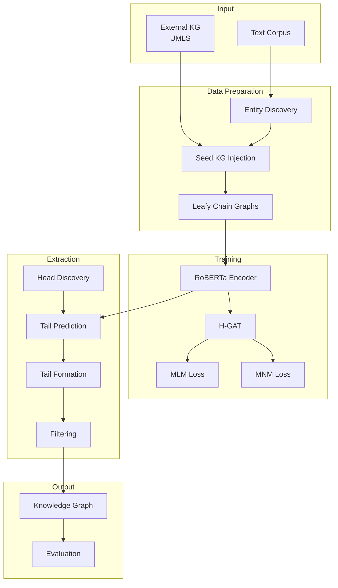

# Document 01: Architecture Overview

## System Design and Data Flow

**Status**: 🟢 **Complete Overview**
**Priority**: P1 (High - provides essential context)
**Paper Reference**: Throughout, especially Section 4
**Purpose**: Understanding how all components fit together

---

## Executive Summary

GraphMERT is a **neurosymbolic AI system** that:

1. **Learns** from both text (syntactic) and knowledge graphs (semantic)
2. **Trains** using joint MLM+MNM objectives
3. **Extracts** explicit knowledge graphs from trained neural representations
4. **Enables** interpretable, editable, and auditable AI

**Key Innovation**: Leafy chain graphs unify syntactic and semantic spaces, enabling vocabulary transfer and cross-modal training.

---

## System Architecture

### High-Level Components



### Component Responsibilities

| Component             | Input                  | Output                    | Purpose                         |
| --------------------- | ---------------------- | ------------------------- | ------------------------------- |
| **Leafy Chain Graph** | Text + Triples         | Graph structure           | Unify syntactic/semantic spaces |
| **RoBERTa Encoder**   | Token sequences        | Contextualized embeddings | Syntactic representation        |
| **H-GAT**             | Embeddings + Relations | Fused embeddings          | Semantic relation encoding      |
| **MLM**               | Masked roots           | Syntactic predictions     | Learn text patterns             |
| **MNM**               | Masked leaves          | Semantic predictions      | Learn KG relations              |
| **Seed Injection**    | Text + UMLS            | Training graphs           | Prepare semantic examples       |
| **Triple Extraction** | Trained model + Text   | Triples                   | Generate knowledge              |

---

## Data Flow

### Training Phase

**Step-by-Step Flow**:

```
1. Text Preprocessing
   "Diabetes mellitus is a metabolic disorder..."
   ↓ Tokenize (BioMedBERT)
   [2156, 23421, 16, 10, 6844, ...]

2. Entity Discovery (Helper LLM)
   ↓ Find biomedical entities
   ["diabetes mellitus", "metabolic disorder"]

3. Entity Linking (SapBERT + UMLS)
   ↓ Match to UMLS CUIs
   C0011849 (Diabetes Mellitus)

4. Triple Retrieval (UMLS)
   ↓ Get relevant triples
   (diabetes mellitus, isa, disease)
   (diabetes mellitus, has_finding_site, pancreas)

5. Contextual Selection (Gemini Embeddings)
   ↓ Rank by similarity to text
   Top triple: (diabetes mellitus, isa, disease) - sim: 0.82

6. Injection Algorithm
   ↓ Balance score + diversity
   SELECT: (diabetes mellitus, isa, disease)

7. Create Leafy Chain Graph
   Roots: [diabetes, mellitus, is, a, ...]
   Leaves: [disease, <pad>, <pad>, ...]
   ↓

8. MLM + MNM Masking
   Mask roots: [diabetes, <MASK>, is, ...]
   Mask leaves: [<MASK>, <pad>, ...]
   ↓

9. Forward Pass (RoBERTa + H-GAT)
   Token embeddings → H-GAT fusion → Transformer
   ↓

10. Loss Calculation
    L_MLM = cross_entropy(predicted_roots, labels)
    L_MNM = cross_entropy(predicted_leaves, labels)
    L_total = L_MLM + μ·L_MNM
    ↓

11. Backpropagation
    Update: Transformer weights + Relation embeddings (W_r)
```

### Extraction Phase

**Step-by-Step Flow**:

```
1. Input: Unseen Text
   "Metformin is a first-line medication for type 2 diabetes."
   ↓

2. Head Discovery (Helper LLM)
   ↓ Extract entities
   ["Metformin", "type 2 diabetes"]

3. Relation Matching (Helper LLM)
   ↓ Which relations apply?
   Metformin: [:plays_role, :has_disposition]
   ↓

4. Create Prediction Graph
   Roots: [metformin, is, a, first, ...]
   Leaves: [<MASK>, <pad>, <pad>, ...] ← relation: :plays_role
   ↓

5. Forward Pass (Trained GraphMERT)
   Token embeddings → H-GAT with :plays_role → Transformer
   ↓ Predict at masked leaf

6. Top-k Token Prediction
   ↓ Get probability distribution
   Top-20: [therapeutic, role, agent, drug, medication, ...]
   ↓

7. Tail Formation (Helper LLM)
   ↓ Combine tokens
   "therapeutic role", "pharmacological agent"
   ↓

8. Similarity Filtering (β = 0.67)
   ↓ Check against source text
   (Metformin, plays_role, therapeutic role) - 0.78 ✓
   ↓

9. Output Triple
   (Metformin, plays_role, therapeutic role)
   Provenance: "Metformin is a first-line medication..."
```

---

## Neurosymbolic Integration

### Two Representations

**Neural (Implicit)**:

- RoBERTa embeddings capture syntactic patterns
- H-GAT relation embeddings encode semantic meaning
- Distributed representations in parameter space
- Approximate, ambiguous, efficient

**Symbolic (Explicit)**:

- Knowledge graph triples: `<head, relation, tail>`
- Discrete, structured, interpretable
- Verifiable, editable, auditable
- Exact reasoning possible

### Bridging the Gap

**During Training**:

```
Syntactic Space ←→ Leafy Chain Graph ←→ Semantic Space
    (Text)              (Bridge)              (KG)
      ↓                     ↓                   ↓
  MLM Loss          Joint Training        MNM Loss
      ↓                     ↓                   ↓
  Learn syntax ←→ Vocabulary Transfer ←→ Learn relations
```

**Key Insight**: Joint training on both spaces enables vocabulary transfer:

- Model learns: "diabetes" (text) ↔ "disease" (KG)
- At extraction: Given "diabetes" in text → Predict "disease" semantically

---

## Key Architectural Principles

### 1. Fixed Graph Structure

**Decision**: Use regular 128-root × 7-leaf structure

**Benefits**:

- Efficient batching (fixed tensor sizes)
- Precompute shortest paths once
- Simplify graph encoding
- GPU-friendly memory layout

**Trade-off**: Limits sequence length to 128 tokens, but sufficient for sentences

### 2. Encoder-Only Architecture

**Decision**: Use RoBERTa (encoder-only) not GPT (decoder)

**Benefits**:

- Bidirectional context (better for entity understanding)
- Smaller models (80M vs billions of parameters)
- Faster inference
- Compatible with masked prediction

**Trade-off**: Needs LLM helper for token combination

### 3. Sparse Semantic Space

**Decision**: Most leaves are `<pad>`, only ~28k injected triples

**Benefits**:

- Focuses learning on high-quality examples
- Prevents overfitting on noisy data
- Maintains relation diversity

**Challenge**: Limited semantic examples vs 124M syntactic tokens

**Solution**: Higher dropout (0.3) on relation embeddings

### 4. Relation Embeddings via H-GAT

**Decision**: Separate relation embeddings (W_r) per relation type

**Benefits**:

- Each relation learns distinct semantics
- Gradient flow directly to relations via MNM
- Interpretable relation representations

**Implementation**: H-GAT fuses relation into leaf embeddings before transformer

### 5. Joint Training Objective

**Decision**: Train MLM and MNM simultaneously with equal weight (μ=1.0)

**Benefits**:

- Syntactic and semantic learning reinforce each other
- Vocabulary transfer happens naturally
- Single unified model

**Finding**: Equal weighting works best (paper ablation)

---

## Model Architecture Details

### RoBERTa Base

**Configuration** (80M parameters):

```julia
RoBERTaConfig(
    vocab_size = 30522,           # BioMedBERT tokenizer
    hidden_size = 512,             # Smaller than standard 768
    num_hidden_layers = 12,
    num_attention_heads = 8,
    intermediate_size = 2048,
    max_position_embeddings = 1024,
    dropout = 0.1
)
```

**Modifications**:

- Attention decay mask (exponential with shortest path)
- Integration point for H-GAT after embedding layer

### H-GAT Integration

**Where**: Between embedding layer and first transformer layer

**Process**:

```
1. Token embeddings from vocabulary
2. For each injected leaf:
   - Get head tokens (all tokens in root)
   - Apply H-GAT attention
   - Fuse relation embedding
   - Replace leaf embedding
3. Pass to transformer layers
```

**Result**: Leaves have relation-aware embeddings

### Training Configuration

**Hyperparameters** (from paper):

```julia
TrainingConfig(
    batch_size = 128,              # Effective (32×4 GPUs)
    learning_rate = 4e-4,          # Max LR
    warmup_steps = 500,
    epochs = 25,
    dropout = 0.1,                 # Regular dropout
    attention_dropout = 0.1,
    relation_dropout = 0.3,        # Higher for relations
    lambda = 0.6,                  # Attention decay base
    mlm_probability = 0.15,
    mnm_probability = 0.15,
    mu = 1.0                       # Loss balance
)
```

**Optimizer**: AdamW with cosine learning rate schedule

**Hardware**: 4× H100 GPUs, BF16 precision, 90 GPU hours

---

## Spaces and Vocabularies

### Syntactic Space (Text)

**Vocabulary**: 30,522 tokens (BioMedBERT)

- Common words: "the", "is", "and"
- Medical terms: "diabetes", "mellitus", "hyperglycemia"
- Subwords: "##ing", "##tion"

**Size**: ~124.7M tokens (350k abstracts)

**Purpose**: Learn linguistic patterns, context, syntax

### Semantic Space (Knowledge Graph)

**Vocabulary**: Subset of syntactic vocabulary used in KG

- Entity names: "disease", "pancreas", "blood"
- Typically 1-3 tokens per tail

**Size**: ~28k triples (limited, high-quality)

**Relations**: 28 types (isa, associated_with, cause_of, ...)

**Purpose**: Learn ontological relationships, semantic meaning

### Vocabulary Transfer

**Mechanism**: Shared token embeddings + joint training

**Example**:

```
Syntactic: "Diabetes is a disease" → Learn "disease" in context
Semantic:  (diabetes, isa, disease) → Learn "disease" as hypernym
Result:    Model understands "disease" both syntactically and semantically
```

**Benefit**: Can predict semantic tokens from syntactic context

---

## Training vs Extraction

### Key Differences

| Aspect        | Training         | Extraction              |
| ------------- | ---------------- | ----------------------- |
| **Input**     | Text + Seed KG   | Text only               |
| **Leaves**    | Some injected    | All masked              |
| **Objective** | Learn relations  | Predict triples         |
| **Output**    | Model weights    | Knowledge graph         |
| **LLM Use**   | Entity discovery | Entity + tail formation |
| **Gradient**  | Updates weights  | None (inference)        |

### Why Training Needs Seed KG

**Problem**: Cannot learn relations from scratch

- Need examples of what relations mean
- Need vocabulary of semantic tokens

**Solution**: Inject ~28k high-quality triples

- Provides relation examples
- Seeds semantic vocabulary
- Enables MNM training

### Why Extraction Doesn't Need Seed KG

**Reason**: Relations already learned during training

- Relation embeddings (W_r) encode meaning
- Model knows semantic vocabulary
- Can predict novel triples

**Process**:

1. Input: Text + learned relation embeddings
2. Output: Predicted semantic tokens
3. Combine: Form new triples

---

## Helper LLM Integration

### Role in System

**Purpose**: Handle linguistic tasks where small model insufficient

**Not a shortcut**: GraphMERT does the essential work (triple prediction)

**Three Uses**:

#### 1. Entity Discovery (Training + Extraction)

```
Task: Find biomedical entities in text
Why LLM: Domain knowledge, named entity recognition
GraphMERT: Too small for comprehensive NER
```

#### 2. Relation Matching (Extraction only)

```
Task: Which relations apply to entity?
Why LLM: Semantic understanding of relation meanings
GraphMERT: Predicts tails, not relations
```

#### 3. Tail Token Combination (Extraction only)

```
Task: Combine predicted tokens into phrases
Why LLM: Grammatical fluency, coherence
GraphMERT: Encoder predicts tokens independently
```

### Constraints on LLM

**Critical**: LLM cannot invent content

- Entities must exist in text
- Relations must be in seed KG
- Tails must use only predicted tokens

**Verification**: All LLM outputs validated

**Paper uses**: Qwen3-32B with "thinking mode"

---

## Performance Characteristics

### Computational Complexity

**Training**:

- Forward pass: O(n²) for attention (n=1024 sequence length)
- H-GAT fusion: O(k·m) per leaf (k=leaves, m=head tokens)
- Negligible overhead from graphs (fixed structure)

**Extraction**:

- Per triple: One forward pass
- Parallelizable across entities
- Bottleneck: LLM calls (cacheable)

### Memory Requirements

**Model**: ~320MB (80M parameters × 4 bytes)

**Training**:

- Batch: ~2GB (128 samples × 1024 tokens × 512 hidden × 4 bytes)
- Total: <4GB (with activations)

**Extraction**: <1GB (single sequence at a time)

### Scalability

**Dataset Size**: Linear scaling

- 350k abstracts → 28k triples
- Larger corpus → more triples
- Limited by seed KG diversity

**Model Size**: Could scale to larger RoBERTa

- 80M → 125M → 355M parameters
- Trade-off: accuracy vs. speed

---

## Error Handling and Quality

### Training Quality

**Metrics to Monitor**:

- MLM loss: Should decrease to ~2-3
- MNM loss: Should decrease to ~4-5 (harder)
- Joint loss: Sum of above
- Relation embedding norms: Should stabilize

**Common Issues**:

- NaN loss → Check gradients, reduce LR
- MNM not decreasing → Check injection quality
- Overfitting → Increase relation dropout

### Extraction Quality

**Metrics to Track**:

- FActScore*: Factuality (target: 69.8%)
- ValidityScore: Ontology alignment (target: 68.8%)
- Triple count: Expected ~100k-150k for diabetes
- Similarity distribution: Should peak near β

**Common Issues**:

- Low FActScore → Model not trained well
- Low ValidityScore → Relations misused
- Too few triples → β too high
- Too many triples → β too low

---

## Design Trade-offs

### Choices Made

| Decision                  | Benefit             | Cost                  |
| ------------------------- | ------------------- | --------------------- |
| **Fixed graph structure** | Efficiency          | Sequence length limit |
| **Encoder-only**          | Bidirectional       | Needs LLM helper      |
| **Small model (80M)**     | Fast, deployable    | Needs LLM helper      |
| **Sparse injection**      | Quality             | Limited examples      |
| **Joint training**        | Vocabulary transfer | Complex training      |
| **Helper LLM**            | Grammaticality      | API costs, latency    |

### Alternatives Considered

**Why not decoder (GPT-style)?**

- Unidirectional context worse for entities
- Larger models needed
- Already suffers from hallucination issues

**Why not end-to-end LLM?**

- Hallucinations (FActScore: 40.2% vs 69.8%)
- Validity issues (43.0% vs 68.8%)
- No relation training
- Not interpretable

**Why not fully symbolic?**

- Cannot learn from text
- Brittle to variations
- Requires manual rules
- Poor generalization

---

## Integration Points

### With External Systems

**UMLS Integration**:

- Entity linking via REST API
- Triple retrieval
- CUI normalization

**LLM Integration**:

- OpenAI API, local models
- Prompt engineering
- Response parsing
- Caching layer

**Evaluation Systems**:

- GraphRAG for QA
- FActScore* calculation
- ValidityScore checking

### With Downstream Applications

**Knowledge Graph Output**:

- Standard triple format
- JSON/CSV export
- Neo4j compatible
- SPARQL queryable

**Applications**:

- GraphRAG retrieval
- Knowledge base population
- Biomedical research
- Clinical decision support

---

## Summary

GraphMERT achieves reliable knowledge graph extraction through:

1. **Unified Representation**: Leafy chain graphs bridge text and KG
2. **Joint Training**: MLM+MNM learn both syntactic and semantic
3. **Relation Embeddings**: H-GAT encodes relation-specific semantics
4. **Quality Focus**: Small, curated seed KG beats large, noisy data
5. **Neurosymbolic**: Neural learning + symbolic output

**Result**: Interpretable, editable, auditable AI with strong factuality and validity.

---

## Next Steps

1. **Understand** this architecture overview
2. **Study** individual components (Docs 02-09)
3. **Implement** following the roadmap
4. **Validate** against paper benchmarks
5. **Extend** to other domains

---

**Related Documents**:

- → [Doc 02: Leafy Chain Graphs](02-leafy-chain-graphs.md) - Core data structure
- → [Doc 04: H-GAT](04-hgat-component.md) - Relation encoding
- → [Doc 07: MNM Training](07-training-mnm.md) - Semantic training
- → [Doc 08: Seed Injection](08-seed-kg-injection.md) - Data preparation
- → [Doc 09: Extraction](09-triple-extraction.md) - KG generation
- → [Implementation Roadmap](00-IMPLEMENTATION-ROADMAP.md) - Practical steps
